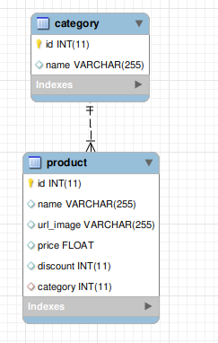

<!-- Improved compatibility of back to top link: See: https://github.com/othneildrew/Best-README-Template/pull/73 -->
<a name="readme-top"></a>
<!--
*** Thanks for checking out the Best-README-Template. If you have a suggestion
*** that would make this better, please fork the repo and create a pull request
*** or simply open an issue with the tag "enhancement".
*** Don't forget to give the project a star!
*** Thanks again! Now go create something AMAZING! :D
-->


<!-- PROJECT LOGO -->
<br />
<div align="center">
  <!-- <a href="https://github.com/othneildrew/Best-README-Template">
    
  </a> -->

  <h3 align="center">Tienda online - Frontend Test</h3>

  <p align="center">
    Construcción de una tienda online
  </p>
</div>


<!-- TABLE OF CONTENTS -->
<details>
  <summary>Tabla de contenidos</summary>
  <ol>
    <li>
      <a href="#acerca-del-proyecto">Acerca del proyecto</a>
      <ul>
        <li><a href="#frontend-roadmap">Frontend Roadmap</a></li>
        <li><a href="#built-with">Built With</a></li>
        <li><a href="#cloud-hosting">Cloud Hosting</a></li>
      </ul>
    </li>
    <li><a href="#estructura-general">Esctructura General</a></li>
    <li><a href="#uso">Uso</a></li>
  </ol>
</details>


<!-- ABOUT THE PROJECT -->
## Acerca del proyecto


[](https://endearing-dragon-9341cf.netlify.app/)

Este proyecto es una prueba de la creación de una tienda online (Backend y Frontend). 

Los objetivos del este proyecto se muestran a continuación en <a href="#backend-roadmap">Backend Roadmap</a>

<!-- <p align="right">(<a href="#readme-top">back to top</a>)</p> -->

<!-- ROADMAP -->
### Backend Roadmap

- [x] Construir una tienda online.

- [X] Utilizar la base de datos que se encuentra en la hoja 2 de éste desafío.

- [x] Desplegar productos agrupados por la categoría a la que pertenecen.

- [x] Generar por separado backend (API REST) y frontend (aplicación que la consuma)

- [ ] Agregar un buscador, el cual tiene que estar implementado a nivel de servidor 
mediante una Api Rest cuyo lenguaje y framework puede ser de libre elección. Es decir, los datos de productos deben llegar filtrados al cliente.

- [x] Desarrollar la aplicación de cliente con vanilla javascript/Vanillajs.

- [x] ¿Puedo usar react y similares? La respuesta es NO, sólo usar vanilla javascript Vanillajs. Si lo desarrollas con react o similares, quedará el ejercicio sin efecto.
    - [x] No se utilizó

- [x] ¿Puedo usar librerías o componentes específicos?, Si, tales como; bootstrap material, Jquery, entre otros.
    - [x] Se utilizó Bootstrap

- [x] Disponibilizar la aplicación en un hosting como a modo de ejemplo, puede ser Heroku, Netlity, Aws u otro.

- [x] Disponibilizar el código en Github.


<p align="right">(<a href="#readme-top">back to top</a>)</p>

### Built With

La construcción de este proyecto se realizo con:

* 
* 
* 
<!-- * [![JQuery][JQuery.com]][JQuery-url] -->

<p align="right">(<a href="#readme-top">back to top</a>)</p>


<!-- ESTRUCTURA GENERAL -->
## Estructura general

[](https://endearing-dragon-9341cf.netlify.app/)


<p align="right">(<a href="#readme-top">back to top</a>)</p>

<!-- ### Installation

_Below is an example of how you can instruct your audience on installing and setting up your app. This template doesn't rely on any external dependencies or services._

1. Get a free API Key at [https://example.com](https://example.com)
2. Clone the repo
   ```sh
   git clone https://github.com/your_username_/Project-Name.git
   ```
3. Install NPM packages
   ```sh
   npm install
   ```
4. Enter your API in `config.js`
   ```js
   const API_KEY = 'ENTER YOUR API';
   ```
    ```html
   const API_KEY = 'ENTER YOUR API';
   ```

<p align="right">(<a href="#readme-top">back to top</a>)</p> -->


<!-- USAGE EXAMPLES -->
## Uso

Este proyecto no tiene ningun fin comercial ni nada parecido. Este base de datos fue provista por bsale

<p align="right">(<a href="#readme-top">back to top</a>)</p>


<!-- MARKDOWN LINKS & IMAGES -->
<!-- https://www.markdownguide.org/basic-syntax/#reference-style-links 
https://github.com/Ileriayo/markdown-badges
-->
[Bootstrap.com]: https://img.shields.io/badge/Bootstrap-563D7C?style=for-the-badge&logo=bootstrap&logoColor=white
[Bootstrap-url]: https://getbootstrap.com
[JQuery.com]: https://img.shields.io/badge/jQuery-0769AD?style=for-the-badge&logo=jquery&logoColor=white
[JQuery-url]: https://jquery.com 